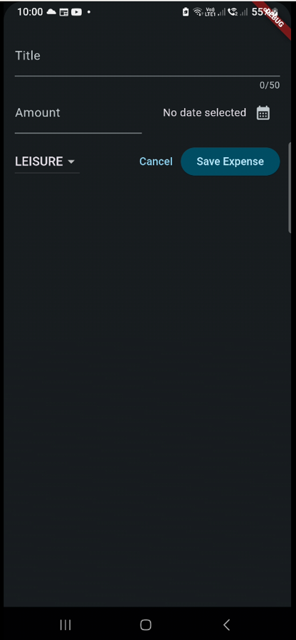

# The Expense Tracker App
 

## About
An app that allows a user to add expenses (name, type, date, amount). The app will then output the expense in a graph that the user can use to view the expenses.

## Features:
  - Tracks expenses
  - Provides graph

## Packages Used:
  - Uuid
  - Intl

## Images
<table>
  <tr>
    <th>Screen Name</th>
    <th>Screenshot</th>
  </tr>
  <tr>
    <td><strong>Home Screen with no items</strong></td>
    <td></td>
  </tr>
  <tr>
    <td><strong>Add Expense</strong></td>
    <td></td>
  </tr>
  <tr>
    <td><strong>Home Screen with items</strong></td>
    <td></td>
  </tr>
  <tr>
    <td><strong>Removed Expense</strong></td>
    <td></td>
  </tr>
</table>
